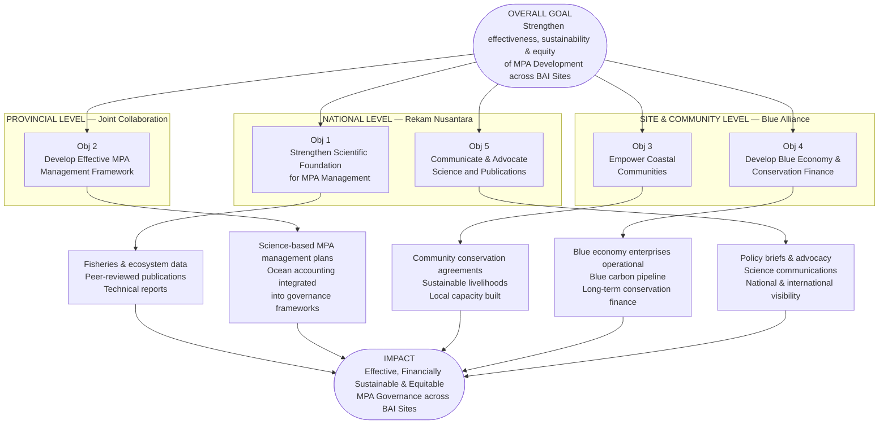

# CONCEPT NOTE
## Collaborative Partnership for Marine Protected Area Development across Blue Alliance Indonesia Sites

**Prepared by:** Rekam Nusantara Foundation
**Date:** 17 April 2026
**Status:** Internal Working Document

---

## 1. BACKGROUND

Indonesia is the world's largest archipelago nation and lies at the heart of the Coral Triangle — the global epicenter of marine biodiversity, where coral reefs and coastal ecosystems function as breeding, nursery, and feeding grounds for an extraordinary array of marine species. The country's coastal and marine ecosystems support the livelihoods of millions of fishing communities who depend directly on healthy seas for food security and economic well-being.

**Blue Alliance Indonesia** operates across two major MPA complexes within this context. In **Central Sulawesi**, Blue Alliance has managed the **Banggai MPA Network** since 2021 — an 810,000-hectare system recognized as a global center of marine biodiversity, particularly for its extraordinary concentrations of endemic reef fish species. In **Maluku Province** — a critical node of the Coral Triangle — several new Marine Protected Areas were established between 2021 and 2022, covering island groups including Tanimbar, Damer, Babar, Romang, Mdona Hiera, Lakor, Moa, and Letti. This culminated in a landmark milestone on 12 February 2026, when the Maluku Provincial Government signed a long-term co-management agreement with Blue Alliance Indonesia Foundation, establishing collaborative governance across **1.5 million hectares** of ocean across six conservation areas — one of the largest provincial marine conservation commitments in Indonesia's history.

Across both sites, significant challenges remain. MPAs face persistent threats including overfishing, illegal destructive fishing (blast fishing and compressor fishing), climate-driven coral mortality, habitat degradation, and community resistance stemming from limited livelihood alternatives. Effective MPA management requires robust scientific data, adaptive monitoring systems, community empowerment, and sustained financing — capacities that demand a multi-institutional approach.

It is within this context that **Rekam Nusantara Foundation** and **Blue Alliance Indonesia** have identified a strategic opportunity to formalize their collaboration, combining complementary organizational strengths to advance the effective development and long-term sustainability of MPAs across all Blue Alliance Indonesia sites.

---

## 2. PROBLEM STATEMENT

While the legal and institutional framework for MPA governance across BAI sites is strengthening, several critical gaps constrain the effectiveness of conservation efforts on the ground:

1. **Data and Evidence Gap** — Many MPAs across BAI's sites lack robust baseline data on fish stocks, reef health, and fisheries dynamics needed to guide adaptive management decisions.

2. **Fisheries Science Capacity** — Local capacity for stock assessment, fisheries resource monitoring, and evidence-based fisheries management planning remains limited.

3. **Community Engagement Deficit** — Fishing communities in and around MPAs often perceive conservation restrictions as economic threats rather than opportunities, leading to low compliance and limited participation.

4. **Blue Economy Underdevelopment** — Alternative and sustainable livelihood options — including aquaculture, ecotourism, and blue carbon — remain nascent, leaving communities without income pathways that align with conservation goals.

5. **Communication and Advocacy Gap** — The value and impact of MPA conservation across BAI sites is insufficiently documented and communicated to national policymakers, donors, and the broader public.

6. **Ecosystem Valuation** — The economic and ecological value of the marine ecosystems across BAI sites has not been systematically assessed, limiting the case for sustained public and private investment in conservation.

---

## 3. ORGANIZATIONAL PROFILES

### 3.1 Rekam Nusantara Foundation (Yayasan Rekam Jejak Alam Nusantara)

Rekam Nusantara Foundation is an Indonesian non-profit organization dedicated to advancing biodiversity conservation through innovative research, science communication, and community engagement. Founded in 2013 and headquartered in Bogor, West Java, the Foundation has a team of **100+ people** and collaborates with ministries, local governments, universities, and national and international NGOs across Indonesia (Legal registration: AHU-0040388.AH.01.12.2025).

**Vision:** Capturing and preserving the extraordinary natural heritage of the archipelago to inspire collective awareness and action for environmental sustainability and a better future of Indonesia.

**Mission:** Integrating art, science, and traditional wisdom to achieve environmental sustainability and human well-being across the Indonesian archipelago. *("Documenting Knowledge, Preserving Life")*

---

**Ocean Program — Fisheries Resource Center of Indonesia (FRCI)**

FRCI is Rekam Nusantara's marine and fisheries science unit, focused on bridging the data-policy nexus to support sustainable ocean management. *FRCI track record (2022–2025): 23 MPAs supported, 6 Area-Based Management sites, 8 Fisheries Management Areas.*

- **Sustainable Fisheries Management** — Science-based management of small-scale fisheries through stock assessments, Ecosystem-Based Fisheries Management (EBFM) using Ecopath with Ecosim (EwE) modeling, and fisheries management planning. Served as Scientific Service Provider (SSP) for the National Commission on Fish Stock Assessment (KOMNAS KAJISKAN) across 11 national Fisheries Management Areas.

- **IKAN App** — A citizen science mobile application for community-based fisheries data collection, deployed at major fishing ports across Indonesia. *Cumulative data (2019–2025): 15,262 trip records and 120,551 length measurements.* Active in Aru Island (Maluku), Central Java, South Sulawesi, Sumatra, NTB, and NTT.

- **MPA Management** — Supports national and local governments in adaptive MPA management. At the national level: supported MMAF in the MPA & OECM Vision 2045 (30×45 target); developed Offshore and Blue Carbon MPA guidelines; and strengthened the national conservation database (SIDAKO). At the site level: reef ecology and fish stock research, MPA cost-benefit analysis, community capacity building, and alternative livelihoods. Active sites: Central Java (6 MPAs) and Liukang Tangaya MPA, South Sulawesi.

- **Ocean Accounts** — Advancing Indonesia's ocean accounting system through the **Ocean for Development (OfD) Program** in collaboration with Norway (NIVA, Statistics Norway) and the national Ocean Accounts Task Force. Pilot ocean accounts completed for Savu Sea, Kapoposang, and **Aru MPAs (Maluku)**. Contributed to Indonesia's revised ocean governance roadmap (2025–2045). Represented at the 10th Our Ocean Conference, 3rd UN Ocean Conference, and Global Ocean Accounts Partnership forums.

- **Blue Carbon** — Published *Indonesia's Blue Carbon Management Prospectus 2025* and *The Seagrass Blue Carbon Measurement Manual*. Field programs covering mangrove and seagrass rehabilitation, ecosystem restoration, and community-based blue carbon livelihoods in Central Java and Saleh Bay, West Nusa Tenggara.

- **Species Conservation & IUU Fishing** — Shark and Ray Conservation Program (CITES compliance, nation-wide supply chain surveys, 400+ participants trained). Led development of the **National Plan of Action to Prevent, Deter and Eliminate IUU Fishing (2025–2029)** in partnership with PSDKP-MMAF.

**Relevance to BAI Sites:** FRCI has existing operational footholds across BAI's key sites. In **Maluku**, IKAN app data collection is active in **Aru Island** and ocean accounting pilots have been completed at **Aru MPAs**. In **Central Sulawesi**, IKAN app is deployed in **South Sulawesi** (adjacent to the Banggai region), and FRCI's active MPA support at **Liukang Tangaya MPA** provides a model for science-based co-management. Together, these provide a data and institutional foundation for expanded collaboration across all BAI sites.

**Key Partners:** KKP/MMAF, PSDKP, BRIN, BAPPENAS, IPB University, Hasanuddin University, Brawijaya University, YKAN/TNC, WWF Indonesia, Coral Triangle Center, Pesisir Lestari, NIVA Norway, CEFAS UK, GEF, IUCN, Ford Foundation, SFACT, Murdoch University, Global Ocean Accounts Partnership, Blue Carbon Accelerator Fund, Norad, Rainforest Trust, Lenfest Ocean Program, Oceans5.

---

### 3.2 Blue Alliance Indonesia

Blue Alliance is an international non-profit organization founded in 2015, dedicated to establishing a global network of Marine Protected Areas. Blue Alliance Indonesia is the Foundation's operational entity in Indonesia, where it currently manages the **Banggai MPA Network** in Central Sulawesi (810,000 hectares, since 2021) and — since February 2026 — holds a co-management mandate across **1.5 million hectares** in **Maluku Province** in partnership with the Maluku Provincial Government.

**Mission:** To actively manage large Marine Protected Areas to regenerate coral reefs and grow a blue economy that lifts surrounding fishing communities out of poverty.

**Operational Model — Two Complementary Teams:**

- **MPA Management Team** — Manages MPAs on the ground through patrol and enforcement, reef and fish biomass monitoring, spawning aggregation studies, community engagement, and ranger programs. Currently deploys 180+ rangers, community officers, and managers across its sites.
- **Blue Economy Team** — Develops and scales sustainable blue economy solutions to reduce poverty and generate long-term financial support for conservation, including:
  - *Aquahub* — Community-based aquaculture (including sea cucumber pilot programs)
  - *BlueWild EcoVentures* — Reef-positive ecotourism (including Nomad Archipelago liveaboard cruises)
  - *Blue Carbon* — Development of carbon finance structures linked to reef and coastal ecosystem protection
  - *Sustainable Fisheries* — Community training in value-added fish processing and sustainable practices

**Maluku Presence (as of February 2026):**
Six conservation areas under co-management with the Maluku Provincial Government, including Koon, Mdona Hiera, Romang, Damer, and Babar Islands MPAs. Total area: 1.5 million hectares.

**Core Strengths:** Large-scale MPA co-management, enforcement operations, ecological monitoring, community livelihood development, ecotourism investment, blue carbon financing, blended finance structures, and government partnership management.

**Key Partners:** Maluku Provincial Government, Central Sulawesi Provincial Government, ICRI (International Coral Reef Initiative), For the Ocean Foundation, and private impact investors.

---

## 4. RATIONALE FOR COLLABORATION

The two organizations bring highly complementary capacities that, when combined, can address the full spectrum of challenges facing MPA development across Blue Alliance Indonesia's sites:

| Rekam Nusantara Foundation | Blue Alliance Indonesia |
|---|---|
| **Science & research** — fisheries stock assessments, reef ecology, ocean accounting, blue carbon | Large-scale MPA field operations & enforcement |
| **Publications** — peer-reviewed papers, technical reports, policy briefs, science communication | 180+ on-the-ground rangers & community officers |
| IKAN app for fisheries data collection | Blue economy enterprise development (aquaculture, ecotourism) |
| National policy networks (KKP, BRIN, BAPPENAS, IPB) | Formal co-management mandate with Maluku Provincial Government |
| Science-to-policy translation & advocacy | Community livelihood programs |
| Blue carbon science & methodology | Blue carbon financing & carbon market access |

Neither organization alone possesses the full range of expertise required for effective MPA development at the scale now mandated across BAI sites. This collaboration is therefore not additive but **synergistic** — the combined capacity significantly exceeds the sum of each organization's individual contribution.

---

## 5. GOAL AND OBJECTIVES

### Overall Goal
To strengthen the effectiveness, sustainability, and equity of Marine Protected Area development across Blue Alliance Indonesia's sites through a science-based, community-centered, and financially resilient collaborative model.

### Specific Objectives

**Objective 1 — Strengthen the Scientific Foundation for MPA Management**
Establish a robust, evidence-based fisheries and ecosystem monitoring system to guide adaptive MPA management, and translate scientific findings into peer-reviewed publications, technical reports, and knowledge products.

**Objective 2 — Develop an Effective MPA Management Framework**
Support the development of science-based MPA management plans and governance frameworks for Maluku's conservation areas, integrating ocean accounting as a tool to systematically value marine ecosystems and inform evidence-based decision-making at the provincial and national levels.

**Objective 3 — Empower Coastal Communities**
Strengthen the capacity and agency of fishing communities within and adjacent to MPAs across BAI sites through participatory monitoring, sustainable livelihood development, and community rights documentation.

**Objective 4 — Develop Blue Economy and Conservation Finance**
Pilot and scale sustainable blue economy enterprises — including sustainable fisheries, aquaculture, ecotourism, and blue carbon — to reduce poverty and generate long-term conservation finance, supported by ecosystem valuation derived from ocean accounting frameworks.

**Objective 5 — Communicate and Advocate**
Produce high-quality scientific publications and public communications documenting the value, impact, and progress of MPA conservation across BAI sites for national policy audiences, donors, and the broader public.

---

### Program Logic Diagram

---

## 6. ROLES AND RESPONSIBILITIES

### Rekam Nusantara Foundation — Science, Publication & National Policy

Rekam Nusantara will lead on science and knowledge production and provide policy support at the national level, including:
- **Leading scientific research** — conducting fisheries stock assessments, reef and ecosystem surveys, ocean accounting, and blue carbon analysis to build the evidence base for MPA management across BAI sites
- **Publications and knowledge products** — producing peer-reviewed papers, technical reports, policy briefs, and science communication materials documenting the collaboration's findings and impact
- **Science-to-policy translation** — linking research outputs to national fisheries management systems, MPA & OECM Vision 2045, and relevant government agencies (KKP, BRIN, BAPPENAS)
- **National policy engagement** — facilitating national policy dialogues, regulatory development, and technical guidelines relevant to BAI's MPA network
- **Academic and research networks** — mobilizing national and international scientific institutions to strengthen the collaboration's credibility and reach

### Blue Alliance Indonesia — Community & Site Level

Blue Alliance will focus on on-the-ground implementation and direct community engagement, including:
- Managing day-to-day MPA operations, enforcement, and monitoring across all BAI co-management areas (Banggai MPA Network in Central Sulawesi and the six conservation areas in Maluku Province)
- Leading community engagement, livelihood development, and local capacity building within and adjacent to MPAs across all BAI sites
- Developing blue economy enterprises (aquaculture, ecotourism, blue carbon) to generate sustainable income for coastal communities
- Providing field logistics, ranger networks, and community access infrastructure for joint activities

### Joint Collaboration — Provincial Level

Both organizations will collaborate jointly at the Maluku Provincial Government level, including:
- Coordinating with relevant provincial governments (Maluku and Central Sulawesi) to align the partnership with provincial conservation priorities and co-management commitments
- Co-designing the monitoring and evaluation framework and shared data governance protocols
- Joint fundraising, donor engagement, and reporting
- Co-producing key publications, policy briefs, and advocacy materials for provincial and national audiences

---

## 7. EXPECTED OUTCOMES AND INDICATORS

| Outcome | Indicator |
|---|---|
| Improved fisheries data coverage across BAI sites | IKAN app active in ≥5 fishing communities across BAI sites; fish stock assessments completed for priority species |
| Strengthened MPA management effectiveness | Standardized monitoring data integrated into MPA management plans for ≥3 conservation areas across BAI sites |
| Ocean accounting framework established | Pilot ocean account completed and published for ≥2 MPAs across BAI sites |
| Enhanced community engagement | ≥3 community conservation agreements formalized; community monitors trained and active across BAI sites |
| Blue carbon pipeline initiated | Mangrove/seagrass baseline maps produced; carbon feasibility assessment completed at ≥1 BAI site |
| Increased visibility and advocacy | Multimedia communication package produced; ≥1 joint policy brief submitted to national government |

---

*This concept note is an internal working document prepared by Rekam Nusantara Foundation for the purposes of partnership planning and internal alignment with Blue Alliance Indonesia. It does not constitute a binding agreement.*
